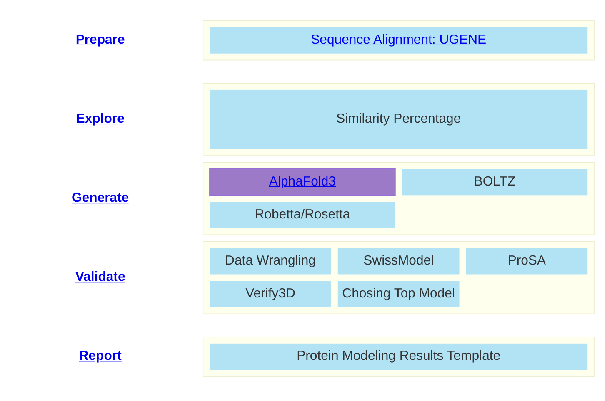



# AlphaFold3

### Preparing Your Files

*Scripts can be found in the Brown Lab OSF or SOP GitHub Repository*

**Files needed**: run_alphafold.py, af3-json.py, FASTA file for your protein sequence

Once you have downloaded these files, upload them to a folder in your ARC directory (or other working directory) using `sftp put`.

You first must convert your FASTA file to the AlphaFold3 supported JSON file. 
Basic command and flag options are as follows:
        `python af3-json.py`
        -f --file_input, name of fasta file input
        -d --directory, name of directory containing fasta files for input
        -o --output, desired name of output file (.json flag not needed)
        -v --verbose, turns on verbose mode for action monitoring

### Run AlphaFold3

Once you have generated the appropriate json file(s), initiate the alphafold python scripts by typing `python run_alphafold.py` using the `--help` flag to determine any flags desired for your specific model.



AlphaFold3 can be run either by use of this run_alphafold.py script *or* by directly calling AlphaFold by typing `alphafold3`. Using the latter option does not allow for multiple models to run in parallel as the .py script does, decreasing overall efficiency when being used in high throughput research. Therefore, we recommend *only directly calling AlphaFold to test the installation of the program*, and not for modeling studies.

### The Outcome

Expected outputs: Models generated (seed-#-sample-#) in cif format, csv file of model rankings, json file listing the confidences of each model.

These outputs can be visualized in a molecular visualization software, such as PyMOL, and can be validated using various techniques, described in later portions of this SOP. Validated models can readily be used for further computational analysis such as molecular docking or molecular dynamics.