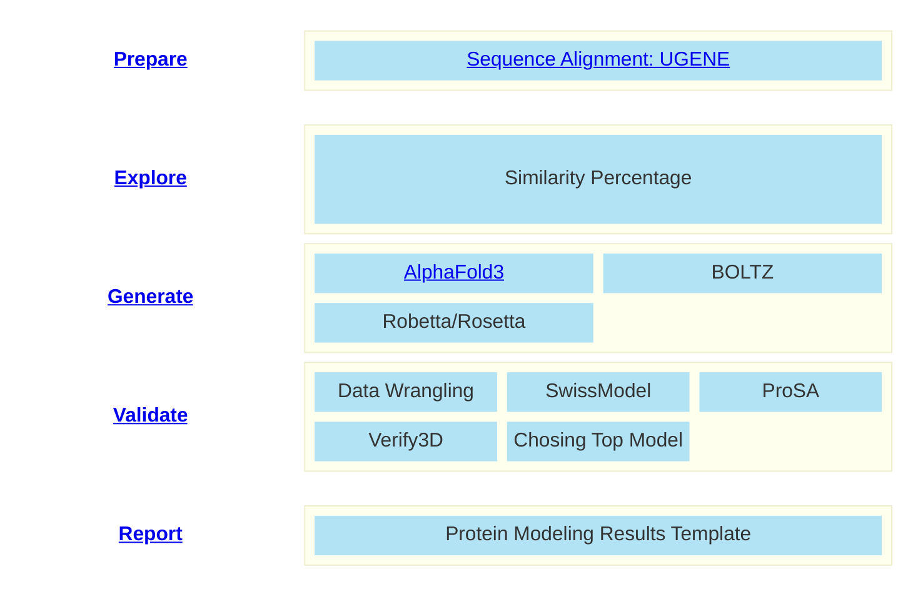

This SOP has modules for:

```mermaid
block-beta
    columns 3
    prep_HM["<a href='/sops/homology-modeling' target='_self'><strong>Prepare</strong></a>"]
    block:prep_HM_block:2
      prep_HM_seq_align["<a href='/sops/homology-modeling/sequence-alignment/' target='_self'>Sequence Alignment: UGENE</a>"]
    end
    expl_HM["<a href='/sops/homology-modeling' target='_self'><strong>Explore</strong></a>"]
    block:expl_HM_block:2
      expl_HM_similarity["Similarity Percentage"]
    end
    gene_HM["<a href='/sops/homology-modeling' target='_self'><strong>Generate</strong></a>"]
    block:gene_HM_block:2
      columns 2
      gene_HM_alphafold3["<a href='/sops/homology-modeling/alphafold3/' target='_self'>AlphaFold3</a>"]
      gene_HM_boltz["BOLTZ"]
      gene_HM_robetta["Robetta/Rosetta"]
    end
    vali_HM["<a href='/sops/homology-modeling' target='_self'><strong>Validate</strong></a>"]
    block:vali_HM_block:2
      columns 3
      vali_HM_dataWrangling["Data Wrangling"]
      vali_HM_swiss["SwissModel"]
      vali_HM_prosa["ProSA"]
      vali_HM_verify3d["Verify3D"]
      vali_HM_top["Chosing Top Model"]
    end
    repo_HM["<a href='/sops/homology-modeling' target='_self'><strong>Report</strong></a>"]
    block:repo_HM_block:2
      repo_HM_report["Protein Modeling Results Template"]
    end

    classDef parent fill:transparent,stroke:none;
    class prep_HM,expl_HM,gene_HM,vali_HM,repo_HM parent
    
    classDef blocks
    class prep_HM_block,expl_HM_block,gene_HM_block,vali_HM_block,repo_HM_block blocks

    classDef subBlocks fill:#B2E3F5,stroke:none
    class prep_HM_seq_align,expl_HM_similarity,gene_HM_alphafold3,gene_HM_boltz,gene_HM_robetta,vali_HM_dataWrangling,vali_HM_swiss,vali_HM_prosa,vali_HM_verify3d,vali_HM_top,repo_HM_report subBlocks
```