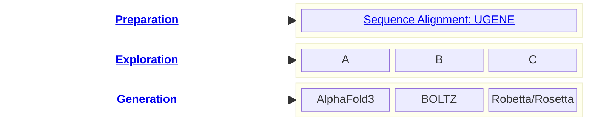



```mermaid
block-beta
    columns 2
    prep_HM["<a href='/homology-modeling' target='_self'><strong>Preparation</strong></a>"]
    block:prep_HM_block
      prep_HM_seq_align["<a href='/homology-modeling/sequence-alignment/' target='_self'>Sequence Alignment: UGENE</a>"]
    end
    expl_HM["<a href='/homology-modeling' target='_self'><strong>Exploration</strong></a>"]
    block:expl_HM_block
      expl_HM_a["A"]
      expl_HM_b["B"]
      expl_HM_c["C"]
    end
    gene_HM["<a href='/homology-modeling' target='_self'><strong>Generation</strong></a>"]
    block:gene_HM_block
      gene_HM_alphafold3["AlphaFold3"]
      gene_HM_boltz["BOLTZ"]
      gene_HM_robetta["Robetta/Rosetta"]
    end
    classDef parent fill:transparent,stroke:none;
    class prep_HM parent
    class expl_HM parent
    class gene_HM parent
    prep_HM-->prep_HM_block
    expl_HM-->expl_HM_block
    gene_HM-->gene_HM_block
```